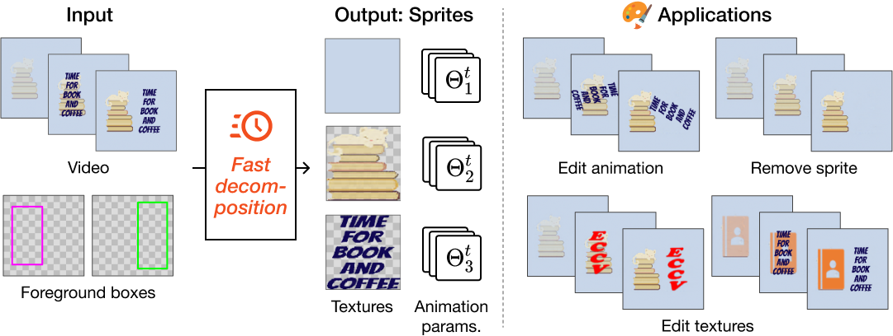

# Fast Sprite Decomposition from Animated Graphics (ECCV2024)

This repository is an official implementation of the paper "Fast Sprite Decomposition from Animated Graphics".
Please also refer to the [project page](https://CyberAgentAILab.github.io/sprite-decompose), [paper](), and our [Crello Animation](https://huggingface.co/datasets/cyberagent/crello-animation) dataset.



## Setup

We check the reproducibility under this environment.

- Python 3.10
- CUDA 11.3

After constructing Python environment, install this project with the following command:

```bash
pip install -e fsd
```

## Decomposition

### Sample-level

You can decompose a video by running the following command:

```bash
./scripts/optimize_sample.sh \
    in_dir="./inputs/62a87468079dcd93634632e7" \
    out_dir="./_outputs/62a87468079dcd93634632e7" \
    engine.n_iters=60000 \
    device=cuda
```

We provide some examples of inputs (video and foreground box) from [Crello Animation](https://huggingface.co/datasets/cyberagent/crello-animation) in `./inputs`.
You can specify the input data by changing the `in_dir` argument.

We manage configurations using [hydra](https://github.com/facebookresearch/hydra) and you can override the [default configuration](https://github.com/CyberAgentAILab/video-layer-decomposition/blob/publication/fsd/fsd/configs/crello_sample.yaml) (our best) by specifying the arguments. We illustrate some useful arguments to adjust your optimization as follows:

- `engine.n_iters`: number of iterations for optimization.
- `engine.save_interval`: interval for saving the optimization progress.
- `engine.timelimit_minute`: time limit for each optimization in minutes. If the optimization exceeds this limit, it will be terminated even if the number of iterations is not reached.
- `engine.resume`: if `True`, resume the optimization from the last checkpoint in `out_dir`.
- `device`: device to run the optimization. You can specify `cuda` or `cpu`.

Outputs are stored in the following directory structure:

```bash
{out_dir}
├── sprites  # Decomposed sprites
│   ├── iter_*
│   │   ├── params.json  # Parameters including affine matrices and opacity
│   │   └── textures  # Textures
│   │       ├── 0.png
│   │       ├── 1.png
│   │       └── 2.png
│   └── iter_*.png  # Output visualization
├── last_checkpoint.pth  # Last checkpoint of optimization
└── progress.json   # Progress log including evaluation results and elapsed time
```

You can refer to `./inputs/{VIDEO_ID}/{VIDEO_ID}.png` and `./outputs/{VIDEO_ID}/animation/iter_*.png` for a brief understanding of the decomposition result. Below is an example:

Input:


Output visualization:


The leftmost is the reconstruction result, the next is the background, and the rest are sprites.

### on Crello Animation

You can also conduct decomposition and evaluation on [Crello Animation](https://huggingface.co/datasets/cyberagent/crello-animation) by running the following command:

```bash
./scripts/optimize.sh \
    out_dir="./_outputs/crello-animation/" \
    data.split="val" \
    device=cuda
```

`data.split` can be `val` or `test`.
You will obtain the same output structure as the sample-level decomposition for all samples in Crello Animation.

## Citation

If you find this code useful for your research, please cite our paper.

```bibtex
@inproceedings{suzuki2024fast,
  title={Fast Sprite Decomposition from Animated Graphics},
  author={Suzuki, Tomoyuki and Kikuchi, Kotaro and Yamaguchi, Kota},
  booktitle={ECCV},
  year={2024}
}
```

### Acknowledgments

Thanks to the following repositories that we referred to in part: [Track-Anything](https://github.com/gaomingqi/Track-Anything/tree/master) and [deformable-sprites](https://github.com/vye16/deformable-sprites)
